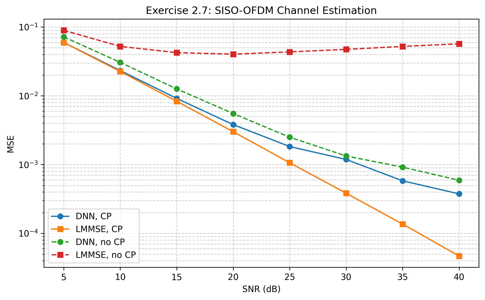

# Exercise 2.7 — Data-Driven SISO-OFDM Channel Estimation


## 1. 檔案分類

區分成3類檔案：

### A. 符合要求的核心檔案
檔案保留原始檔名與結構，並填寫空缺程式與回答註解問題：

- `main.py`：保留題目原始寫法
- `tools/networks.py`：補完 `build_ce_dnn()` 中的 TODO
- `tools/raputil.py`：補完 `MMSE_CE()` 中的 TODO、回答其中註解問題
- 其餘 `tools/*.py`：保留原始檔案

### B. 為了 Colab / GitHub 重現而加的輔助檔案
這些檔案是附加工具，不會取代原始 starter code：

- `plot_results.py`：畫出最終 MSE 曲線
- `generate_channel_data.py`：重新生成 `channel_train.npy` / `channel_test.npy`

### C. 模擬結果檔案放置資料夾
放置在results資料夾中：

- `final_results_200epochs.csv`:數據表格
- `figure_2_9_reproduced_200ep.png`:模擬結果圖檔

---


## 2. 環境設定

### 2.1 Colab 測試環境
已在 Colab 以 `tensorflow.compat.v1` 模式驗證可跑

安裝：
- tensorflow>=2.16
- numpy
- scipy
- matplotlib
- pandas


### 2.2 建議環境
- Python 3.10+
- TensorFlow 2.x（使用 `tensorflow.compat.v1`）
- NumPy
- SciPy
- Matplotlib
- Pandas

---

## 3. 如何執行

## 依照 starter code 的方式
題目原始流程是直接修改 `main.py` 內的三個參數：

- `ce_type = 'dnn'` 或 `'mmse'`
- `test_ce = False` 或 `True`
- `CP_flag = True` 或 `False`

然後執行：

```bash
python main.py
```

對應流程如下：

### (1) 訓練 DNN（有 CP）
```python
ce_type = 'dnn'
test_ce = False
CP_flag = True
```

### (2) 測試 DNN（有 CP）
```python
ce_type = 'dnn'
test_ce = True
CP_flag = True
```

### (3) 測試 LMMSE（有 CP）
```python
ce_type = 'mmse'
test_ce = True
CP_flag = True
```

### (4) 無 CP 情況（虛線）
把 `CP_flag = False` 後重複 DNN / LMMSE 測試。


---

## 4. 通道資料說明

原公開 starter code 會讀取：

- `tools/channel_train.npy`
- `tools/channel_test.npy`

由於公開版本通常不附上這兩個檔案，因此自行重新生成：

### 自行重新生成
```bash
python generate_channel_data.py
```

---

## 5. 題目設定

- OFDM subcarriers: `K = 64`
- Pilot symbol: 第 1 個 OFDM symbol，64 個 QPSK pilots
- Data symbol: 第 2 個 OFDM symbol，64-QAM
- SNR: 5 dB 到 40 dB，每 5 dB 一點
- Channel estimators:
  - DNN-based channel estimator
  - LMMSE channel estimator
- Scenarios:
  - `CP_flag=True`
  - `CP_flag=False`

---

## 6. 實際做法

### Step 1
保留原始 `main.py` 與 `tools` 架構不變，只補：
- `tools/networks.py`
- `tools/raputil.py`

### Step 2
先用 DNN 訓練有 CP 的模型，再測試有 CP 的 DNN。

### Step 3
再測試 LMMSE（有 CP）。

### Step 4
把 `CP_flag=False`，重新做無 CP 的 DNN 與 LMMSE 比較。

### Step 5
將最終結果整理成：
- `results/final_results_200epochs.csv`
- `results/figure_2_9_reproduced_200ep.png`

---

## 7. 模擬結果圖放置位置

最終圖檔放在：

```text
results/figure_2_9_reproduced_200ep.png
```

下方是同一張圖：



---

## 8. 最終數據表格（200 epochs）

| SNR (dB) | DNN, CP | LMMSE, CP | DNN, no CP | LMMSE, no CP |
|---:|---:|---:|---:|---:|
| 5  | 0.05963295 | 0.05967748 | 0.07203503 | 0.08969138 |
| 10 | 0.02332234 | 0.02260326 | 0.03064066 | 0.05232537 |
| 15 | 0.00918118 | 0.00833277 | 0.01262022 | 0.04248572 |
| 20 | 0.00381768 | 0.00301082 | 0.00552399 | 0.04038494 |
| 25 | 0.00183104 | 0.00106430 | 0.00250404 | 0.04356812 |
| 30 | 0.00118761 | 0.00038338 | 0.00133422 | 0.04738613 |
| 35 | 0.00058137 | 0.00013652 | 0.00091831 | 0.05232270 |
| 40 | 0.00037521 | 0.00004686 | 0.00059252 | 0.05709820 |

CSV 檔也已存成：
```text
results/final_results_200epochs.csv
```

---

## 9. 結果分析

### 9.1 有 CP 的情況
- DNN 與 LMMSE 都會隨 SNR 上升而改善。
- LMMSE 在整個 SNR 範圍內仍略優於 DNN。
- 不過 DNN 在訓練到 200 epochs 後，相比 50 epochs 已有明顯提升，尤其在高 SNR 區域改善很大。

### 9.2 無 CP 的情況
- 無 CP 時，兩種方法都比有 CP 差。
- LMMSE 在無 CP 下的 MSE 不再隨 SNR 持續下降，顯示誤差已受 ISI / ICI 主導。
- DNN 在無 CP 下仍比無 CP 的 LMMSE 好很多，代表資料驅動方法確實能學到部分干擾補償能力。

### 9.3 與題目要求的對應
結果已經滿足：
1. 實作 DNN-based 與 LMMSE channel estimator
2. 比較有 CP 與無 CP 兩種情況
3. 給出 MSE 對 SNR 的曲線
4. 顯示移除 CP 後性能惡化

---

## 10. 畫圖方式

如果要重新畫圖：

```bash
python plot_results.py
```

---

## 11. 注意事項

- 若只想快速驗證流程，可先把 DNN 的 `training_epochs` 降低，但結果很容易會不理想
- 若要更接近最終結果，可能要使用 200 epochs 以上
- 200 epochs用colab無gpu支援下完整模擬全部數據時間約2~2.5小時

